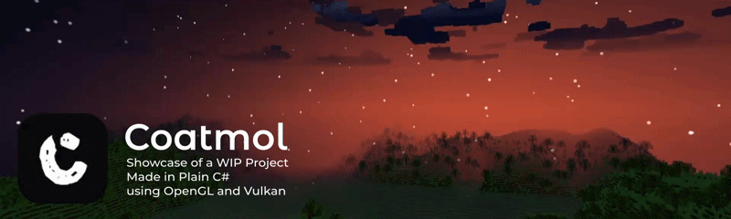

**Hello, I am a**

 
🔧 Deep-diving into **low-level engine architecture & graphics programming** 
😀 Passionate about game dev, networking, and custom and backend systems

---

### 🧰 Languages and Tools

---

### 📈 Statistics

 

#
